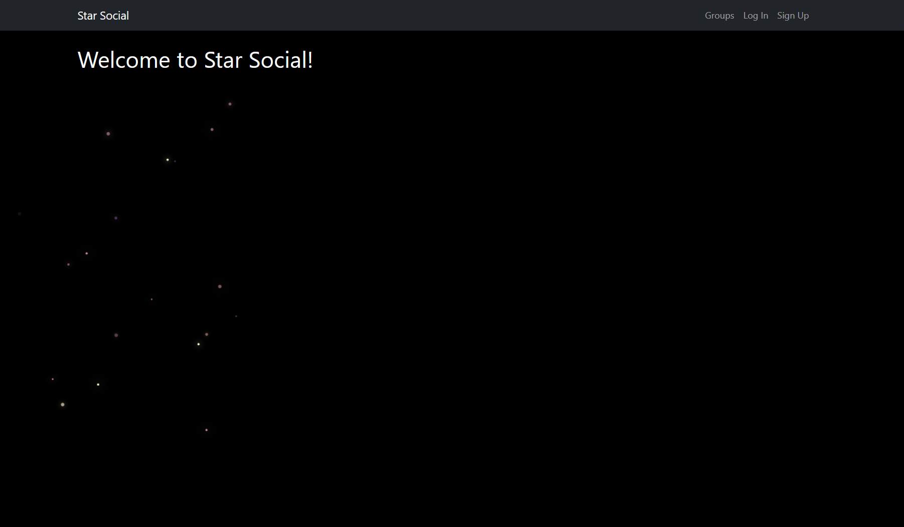
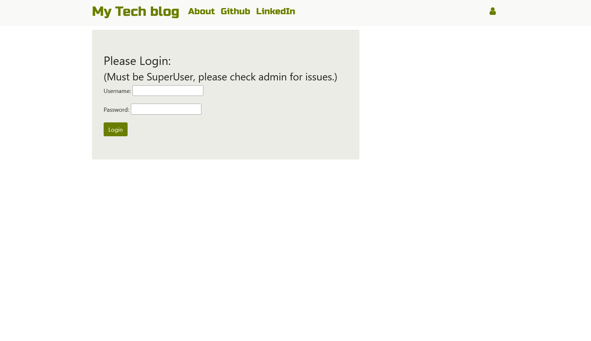
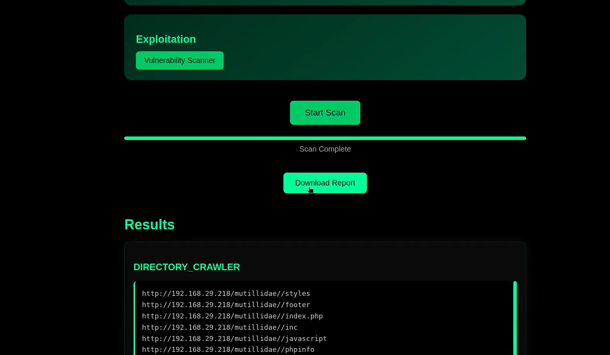

# Web Development Portfolio

A curated collection of my full-stack web development projects built using Django and Flask. These projects focus on backend architecture, scalability, and real-world functionality.

---

## Projects

### 1. Social Media Web Application (Django)

A full-stack social platform with authentication, group interactions, and user engagement features.

**Key Features:**
- User authentication system  
- Post creation and group participation  
- User tagging (@username)  
- Scalable backend using Django CBVs  

**Preview:**

[View Project](https://github.com/hackwithhimanshu/social_media_web_application)

---

### 2. Blog Clone Project (Django)

A multi-user blogging platform with content moderation and commenting system.

**Key Features:**
- Blog post creation and management  
- Commenting system for engagement  
- Admin approval for content moderation  
- Role-based access control  

**Preview:**

[View Project](https://github.com/hackwithhimanshu/blog_clone_project)

---

### 3. Web Automation & Analysis Platform (Flask)

A modular automation platform that executes Python scripts and generates analytical reports.

**Key Features:**
- Execution of external automation scripts  
- PDF report generation  
- Modular and scalable architecture  
- Centralized automation interface  

**Preview:**

[Watch Demo](web_recon_demo/video.mp4)  
[View Project](https://github.com/hackwithhimanshu/web_automation_and_analysis_platform)

---

## Tech Stack

- **Languages:** Python, JavaScript  
- **Frameworks:** Django, Flask  
- **Frontend:** HTML, CSS  
- **Database:** SQLite / PostgreSQL  
- **Concepts:** REST, MVC/MVT, CRUD, Authentication  

---

## What This Portfolio Demonstrates

- Strong backend development using Django and Flask  
- Ability to design scalable and modular applications  
- Experience with real-world features like authentication, automation, and content management  
- Clean project structuring and documentation  

---

## Author

Himanshu Kumbhaj
